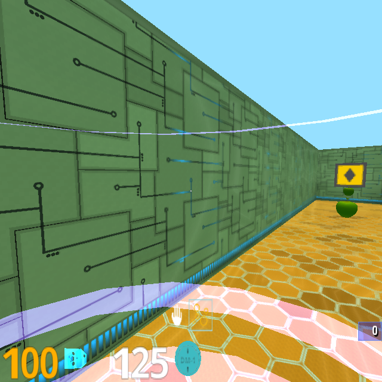

# CS6795 Course Team Project

### Overview

In this project, we are simulating a situation where an animal, like squirrel, try to search for food and run away from the predators and humans. We simulate this since it is fairly normal in our campus and surroudings. To simulate such an interaction between agents and environment. We resort to use Reinforcement Learning (RL) which is super suitable for this task. For convinience, we build our model based on the open source library, [Deepmind Lab](https://github.com/deepmind/lab).

### Dependencies

1. [Deepmind Lab](https://github.com/deepmind/lab). Install deepmind lab according to the instructions in the original git repository.

2. [PyTorch](http://pytorch.org/). Since we need to analyze the visual signals perceived by the agents, we use convolutional neural network (CNN) in PyTorch. Please also refer to the orignal repository for the installation.

3. Git clone our repository to deepmind *lab* directory. Then, add to *lab/BUILD* the following lines"

```bash
py_binary(
    name = "squirrel",
    srcs = ["RLCourseProject/squirrel.py"],
    data = [":deepmind_lab.so"],
    main = "RLCourseProject/squirrel.py",
)
```

4. Move the included lemon_hall.lua" file into DeepMind Lab's *lab/assets/game_scripts/*

5. Edit *lab/assets/game_scripts/common/make_map.lua* lines 6-9 so that it is now:
```bash
local pickups = {
    A = 'apple_reward',
    G = 'goal',
    L = 'lemon_reward',
}
```

6. Create a directory named 'models' inside this repository, that is where your policy will be saved after each episode/epoch.

7. Edit lines 100 and 259 in *squirrel.py*, so that the paths reflect your own machine. For example, if you have cloned the repo in your *Documents* directory, they should be:
```bash
self.root = '/home/<your_account>/Documents/lab/RLCourseProject/'
```
Nice to see you here. All you need should be set up. Keep going to train your own agent.

### Model

In this project, we are using the Policy Gradient (PG) algorithm for the learning of policy. It is simple and straightforward. You can get a good sense from the [Karpathy's blog](http://karpathy.github.io/2016/05/31/rl/). Once you understand what the Policy Gradient is, you can move to the next step, training the agent.

Also, if you want to learn more about RL, there are difinitely a lot resources, such as [David Silver's course](http://www0.cs.ucl.ac.uk/staff/d.silver/web/Teaching.html), [Denny Britz's blogs](http://www.wildml.com/2016/10/learning-reinforcement-learning/).

### Training

Once you have installed the above two main dependencies, you should be able to run the code to train the agents. Go to *lab* directory, and simply run:

```bash
$ bazel run :squirrel --define headless=false -- --length=1000 --episode=20 --height=256 --width=256
```

By default, toy_agent launches on the demo map. Note that you can change the level being run by passing the --level_script parameter like so:
```bash
$ bazel run :squirrel --define headless=false -- --length=1000 --episode=20 --height=256 --width=256 --level_script tests/demo_map
$ bazel run :squirrel --define headless=false -- --length=1000 --episode=20 --height=256 --width=256 --level_script lemon_hall
```

If it successfully runs, you will see the following window:

-><-


